# Chapeau noir

On commence avec le pseudo d'un hacker nommé `mousshack`.

Ici, on peut soit trouver son profil Hack The Box, qui a un lien vers son GitHub :

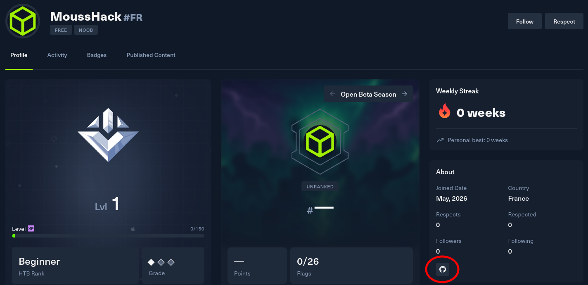

Sinon, on peut directement trouver son GitHub, où il prétend avoir une OPSEC parfaite :

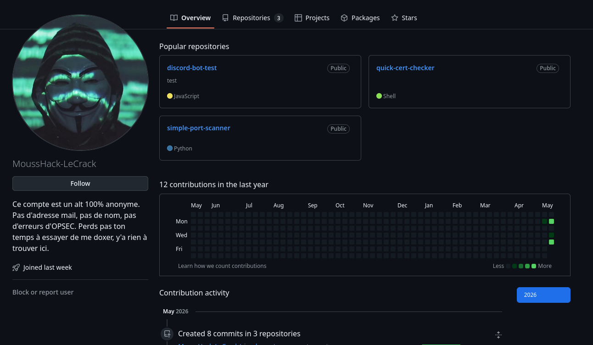

On va explorer son GitHub et trouver qu'il a développé plusieurs outils.

On se rend compte assez rapidement qu'il n'y a pas grand-chose d'exploitable ici (pas d'e-mail dans le premier commit, pas de commits qui suppriment des infos sensibles, etc.).

On se rend compte que, sur son repo de port scanner, il y a un gif de démo avec un compte utilisateur assez intéressant :

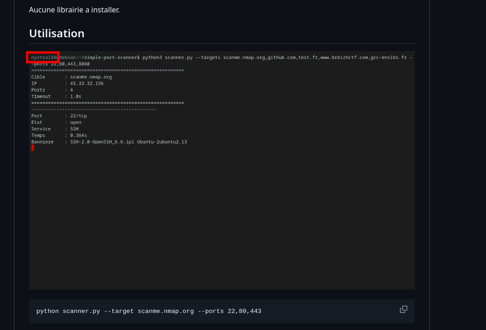

Un certain `nyztral56`, cela ressemble beaucoup à un pseudo.

On va donc utiliser des outils pour chercher des usernames à travers des sites.

On va trouver un compte Reddit sous ce pseudo :

(J'aime beaucoup, personnellement, utiliser le username search de l'OSINT toolkit de [hiippiiie](https://x.com/hiippiiie).)

https://osint.hippie.cat/

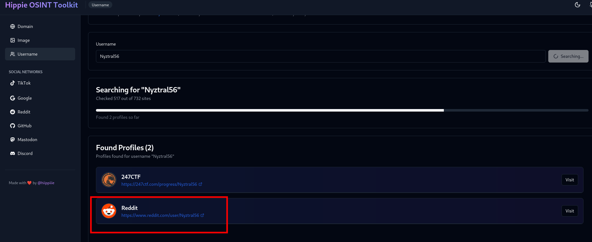

Un outil connu comme Blackbird fera également l'affaire :

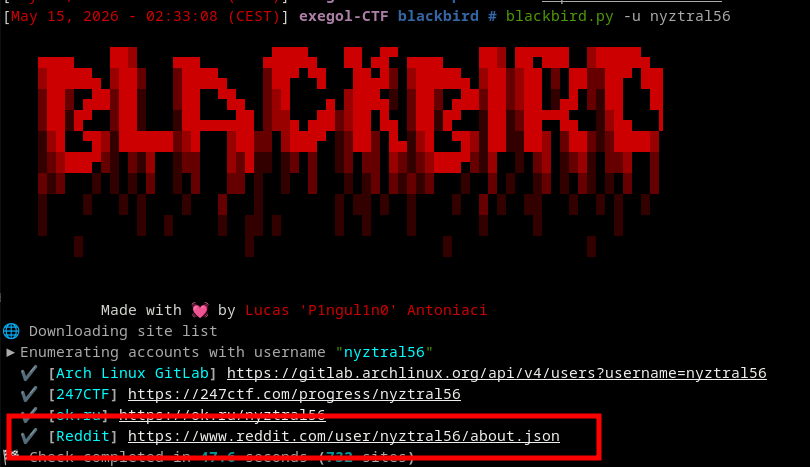

Sur le compte Reddit, on apprend qu'il possède un nom de domaine :

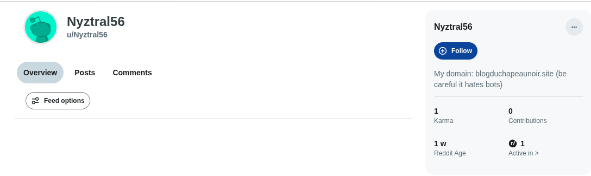

`blogduchapeaunoir.site`

Il est également écrit que le site déteste les bots (en effet, si le site détecte un user agent IA, il ne va pas charger la bonne page du site).

On ouvre donc le site sur notre navigateur et on tombe sur un site de blog.

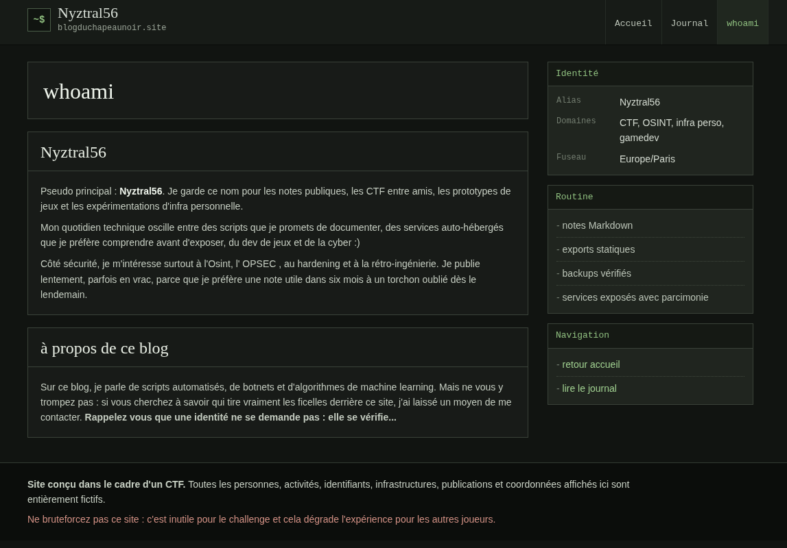

Il y a une phrase en gras sur le whoami qui retient notre attention :

`Rappelez-vous qu'une identité ne se demande pas : elle se vérifie...`

Après un peu de recherche sur les moyens de vérifier une identité sur un site web, on pense à regarder le `/.well-known/keybase.txt`.

Le `keybase.txt` permet de prouver qu'une identité possède des droits administrateur sur un site grâce à une signature PGP.

On se rend donc sur https://blogduchapeaunoir.site/.well-known/keybase.txt

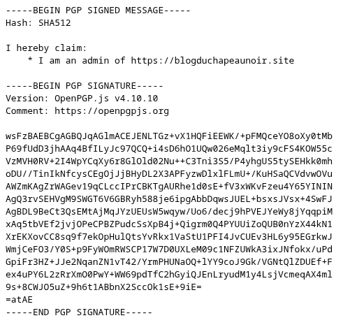

On va pouvoir analyser la signature PGP afin de trouver son issuer ID. Pour cela, on peut utiliser un site comme :
https://lockedpgp.com/

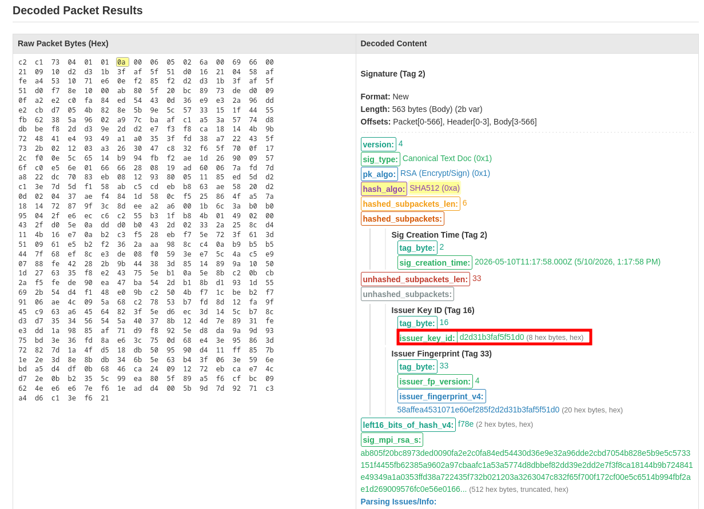

On trouve comme ID : `d2d31b3faf5f51d0`

On va ensuite chercher cet ID sur keybase.io et tomber sur un profil :

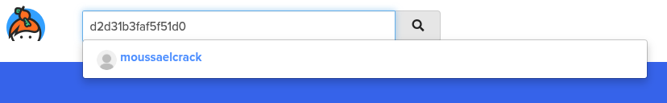

Il nous dit de lui envoyer un mail. Pour trouver son adresse, on va analyser sa clé publique, qui est trouvable sur son profil :

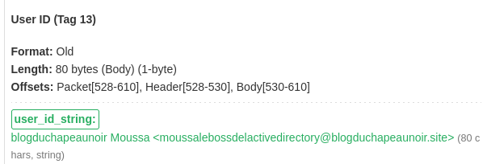

On trouve son adresse, on lui envoie un mail et on obtient la première partie du flag en réponse :

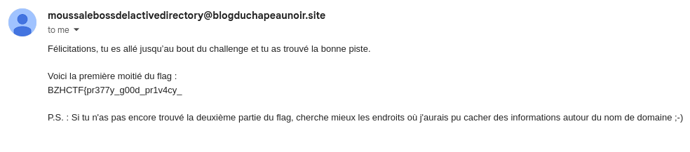

Après quelques recherches, nous pensons à regarder les records DNS TXT et on trouve la deuxième et dernière partie du flag.

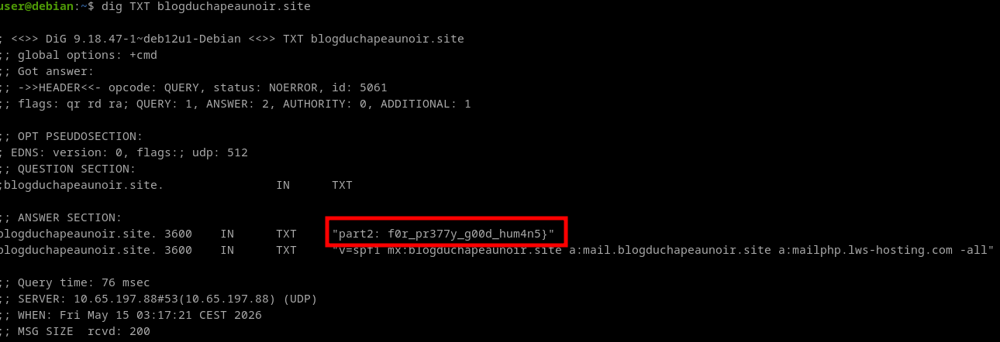

```
BZHCTF{pr377y_g00d_pr1v4cy_f0r_pr377y_g00d_hum4n5}
```
