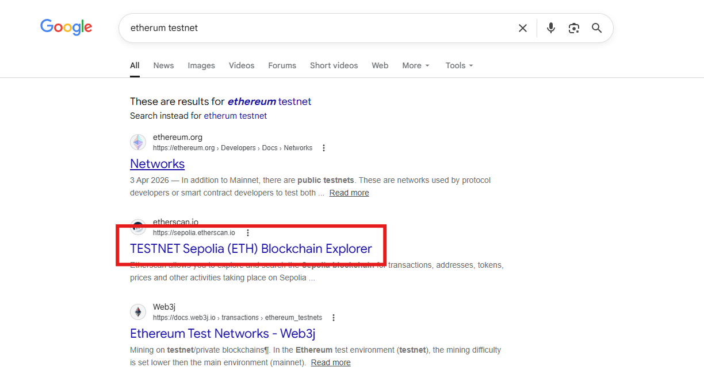
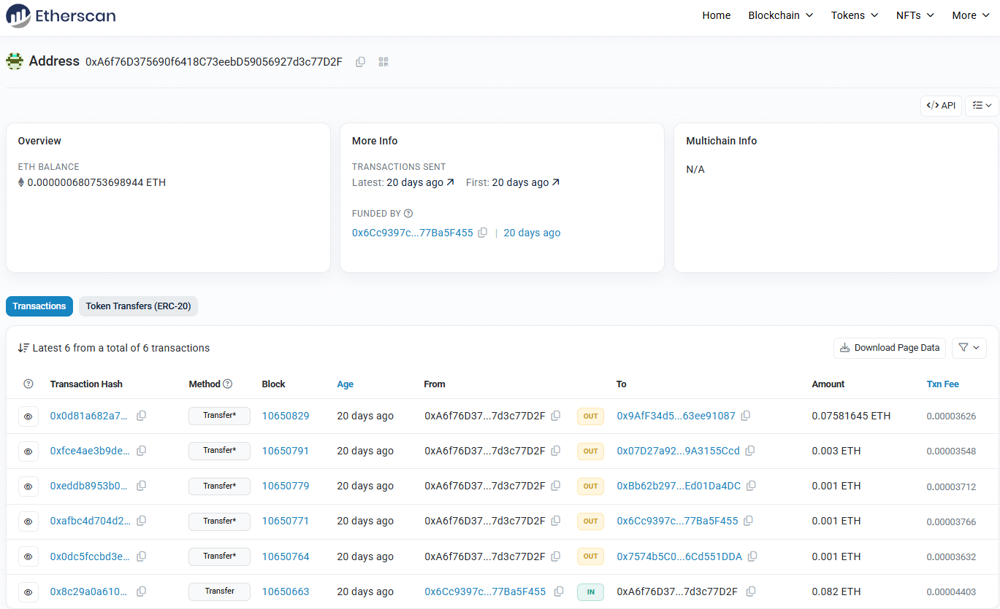
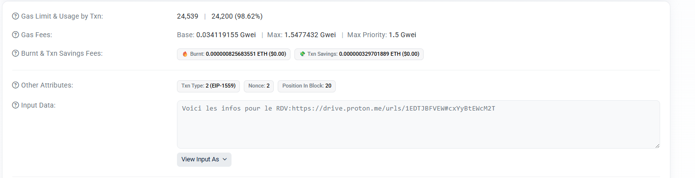
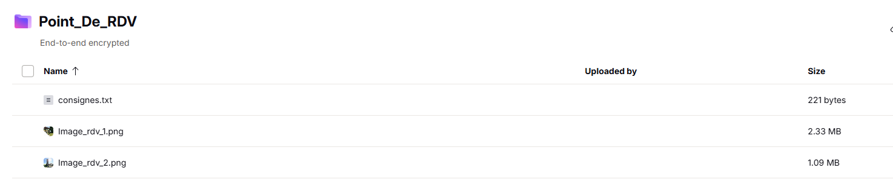
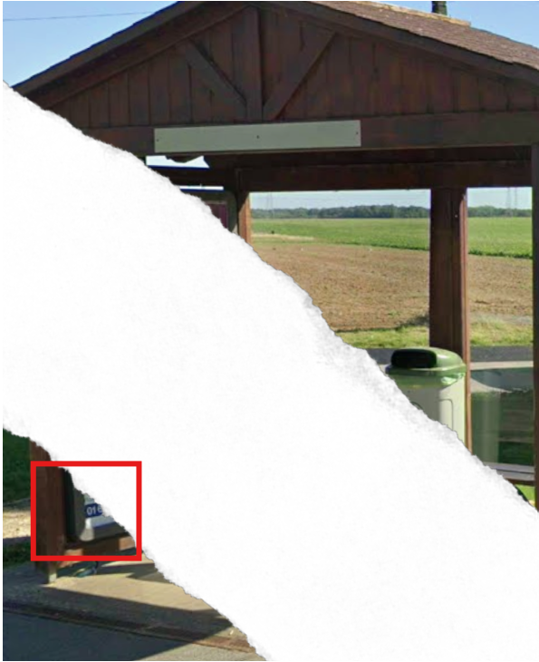
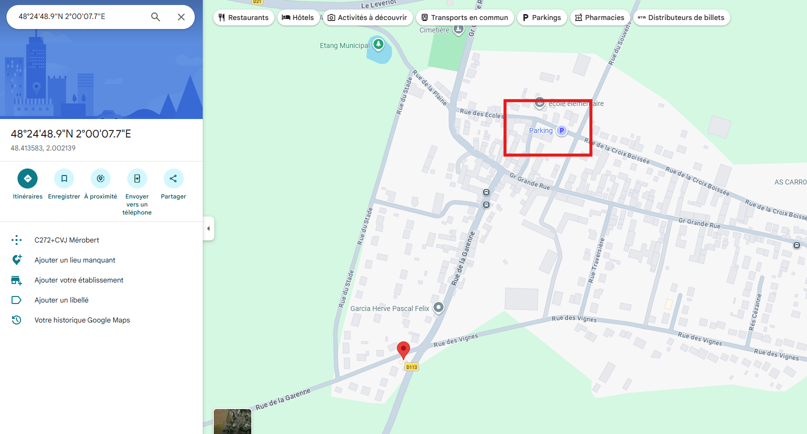
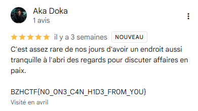

# Cible Finale

On commence avec la chaîne de caractères `0xA6f76D375690f6418C73eebD59056927d3c77D2F` et on se rend rapidement compte qu'il s'agit d'une adresse Ethereum.

En cherchant sur Google, on tombe rapidement sur Sepolia, qui est probablement le testnet le plus populaire.



On se rend donc sur https://sepolia.etherscan.io/ et on recherche l'adresse donnée dans l'énoncé du challenge.



On tombe sur différentes transactions, mais celle qui va nous intéresser est https://sepolia.etherscan.io/tx/0xeddb8953b0ee9e6e011047a3b9b22e3554040a2fa8375357ca01a1875a7c1f14



En convertissant l'input data en UTF-8, on tombe sur ce lien : https://drive.proton.me/urls/1EDTJBFVEW#cxYyBtEWcM2T



Voici le contenu de `consignes.txt` :
```
Chers clients,
Le point de rendez-vous est confirmé. Garez-vous sur le parking de l'église de la ville.

Le Boss a insisté lourdement pour qu'on choisisse cet endroit précis.

Soyez à l'heure, 20 h le 23/05/2026.
```

Il nous faut d'abord localiser l'endroit sur les images.



On remarque sur la première image que nous sommes en Île-de-France, car le numéro sur l'affiche commence par 01.

Avec les éléments de l'étape 2, nous pouvons ensuite faire une requête Overpass Turbo pour trouver les endroits en Île-de-France où il y a un château d'eau, un abribus et une bouche d'incendie. (On aurait également pu utiliser le transformateur électrique.)

```
[out:json][timeout:100];

{{geocodeArea:Île-de-France}}->.searchArea;

(
nwr["man_made"="water_tower"](area.searchArea);
)->.water;

(
nwr["amenity"="shelter"](area.searchArea);
)->.bus;

node(around.water:20)(around.bus:20)["emergency"="fire_hydrant"](area.searchArea);

out skel;
```

Ce qui nous donne cet endroit : 48°24'48.9"N 2°00'07.7"E



On trouve rapidement le parking de l'église du village ainsi que le flag en arrivant.



`BZHCTF{N0_0N3_C4N_H1D3_FR0M_Y0U}`
