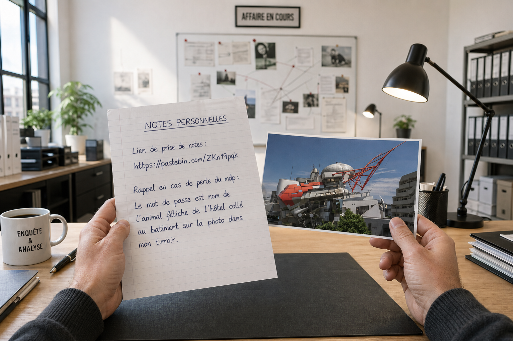
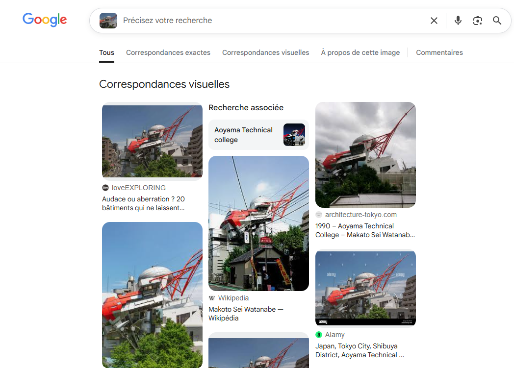
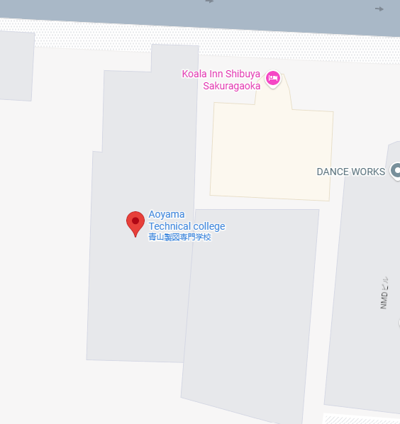
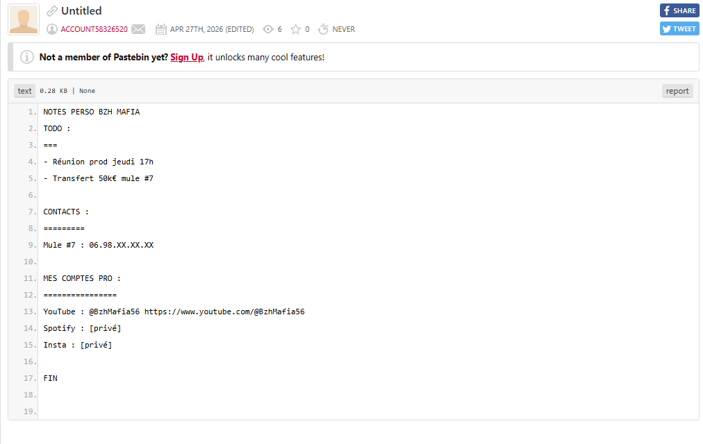
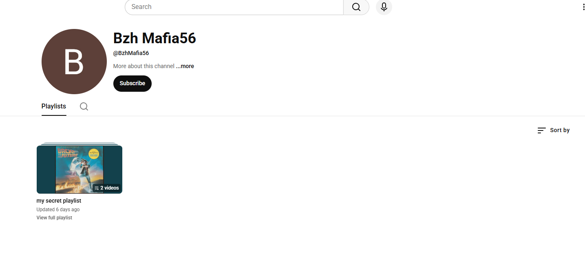
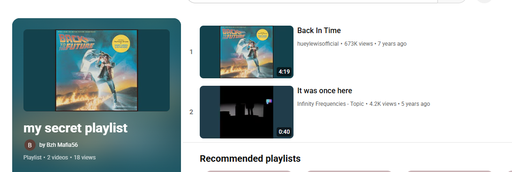
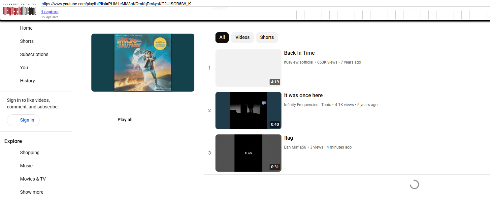

# Double Vie

On commence avec cette image :

On commence par se rendre sur le Pastebin : https://pastebin.com/ZKn19pqk

On voit qu'il est verrouillé et qu'il nous faut un mot de passe.

La note nous dit que le mot de passe est l'animal fétiche de l'hôtel collé au bâtiment sur la photo.

Avec une recherche par image inversée, on tombe tout de suite sur l'"Aoyama Technical College".

En regardant sur Maps, on peut voir qu'il y a un hôtel collé à ce dernier avec le mot `koala` dans son nom. C'est le mot de passe de notre Pastebin.

L'information qui va nous intéresser ici est le lien YouTube. On remarque qu'il y a une playlist nommée "my secret playlist".

https://www.youtube.com/playlist?list=PLtM1eMM8hKQmKqDmkysKOfJJISOB6fW_K

Avec les noms des musiques de la playlist, on peut en déduire que nous devons utiliser Wayback Machine (`archive.is` fonctionne aussi).

On trouve un snapshot du site et on voit qu'il y a une vidéo nommée `flag`. On clique dessus et on obtient notre flag en écoutant la vidéo.

https://www.youtube.com/watch?v=mnkQwb0zr9k&list=PLtM1eMM8hKQmKqDmkysKOfJJISOB6fW_K&index=4

`BZHCTF{Sylvain_Durif}`
