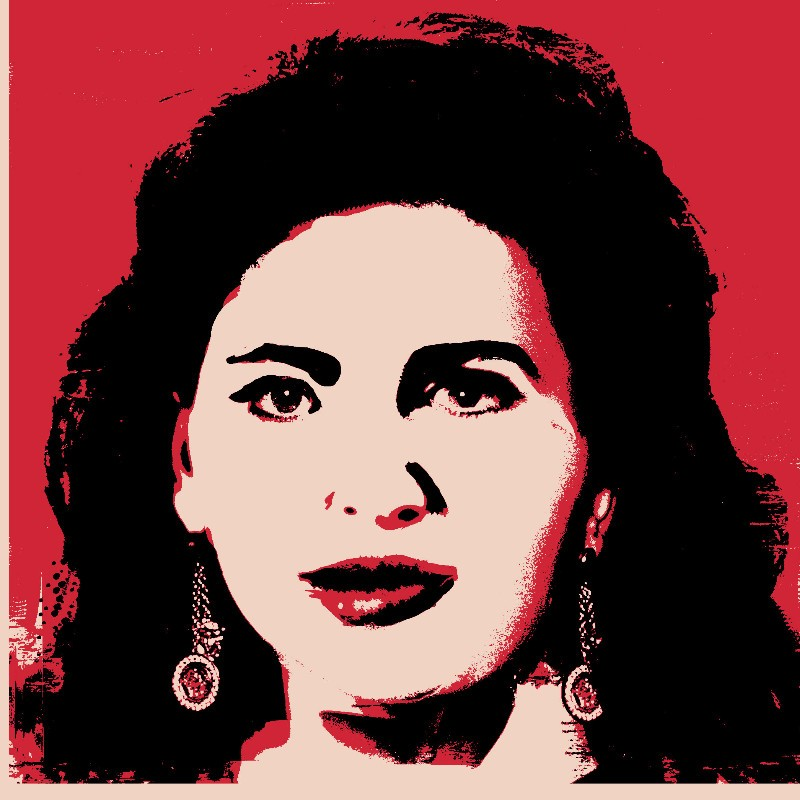
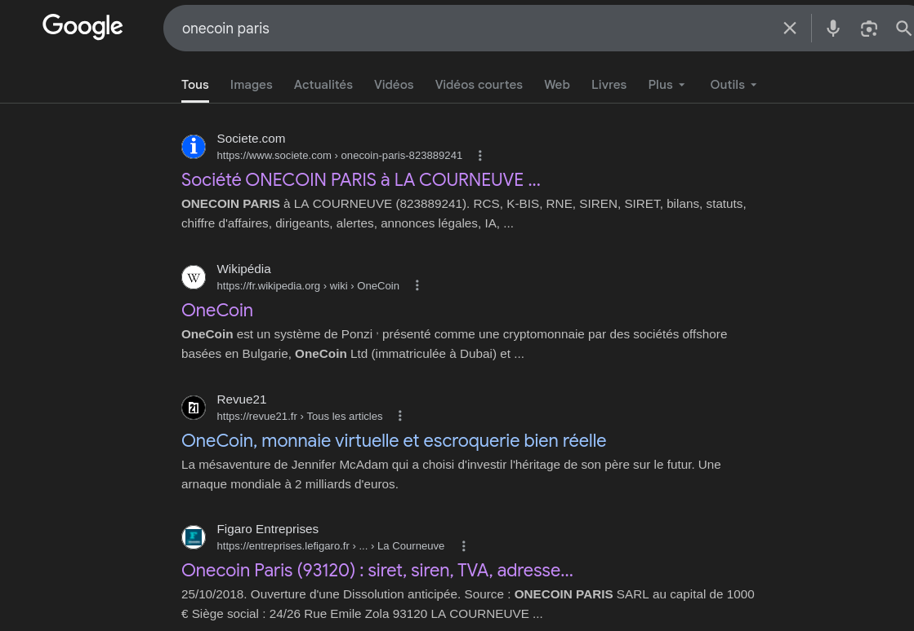
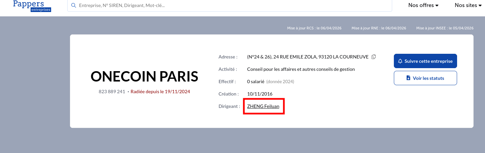
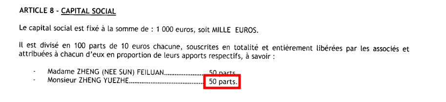

# LinkedIn ou Interpol

On commence avec cette image :

Avec une recherche inversée, on tombe sur une identité, celle de **IGNATOVA RUJA**.

On tombe également sur un compte LinkedIn :
https://www.linkedin.com/in/ruja-ignatova-bb2314240/

Une rapide recherche Google nous permet d'apprendre qu'elle a fait partie d'une grande arnaque à la cryptomonnaie nommée **OneCoin**.

On nous demande de trouver des informations sur la branche parisienne de cette arnaque, donc nous allons chercher "OneCoin Paris" sur Google.

On remarque qu'il y a une société à ce nom.

On peut aller chercher plus d'infos sur cette entreprise sur un site comme https://www.pappers.fr/entreprise/onecoin-paris-823889241.

On peut trouver ici la première partie de notre flag, qui est **Feiluan**.

Pour la deuxième partie du flag, on peut consulter les statuts de l'entreprise et voir que l'associé a obtenu **50 parts** à la création de l'entreprise.

Ce qui nous donne notre flag final :
`BZHCTF{Feiluan_50}`
