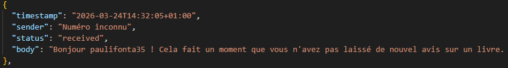
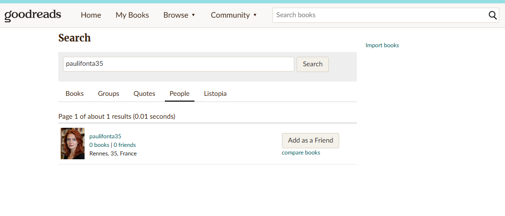
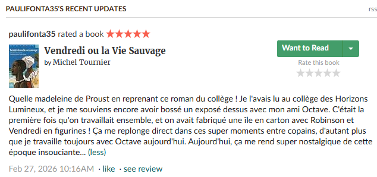
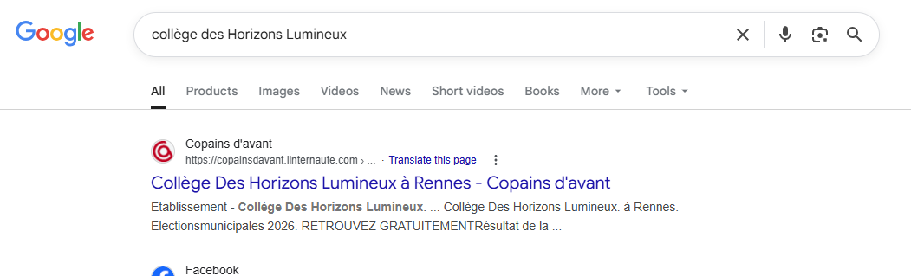
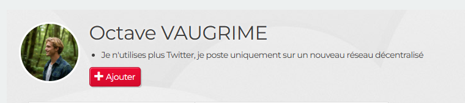
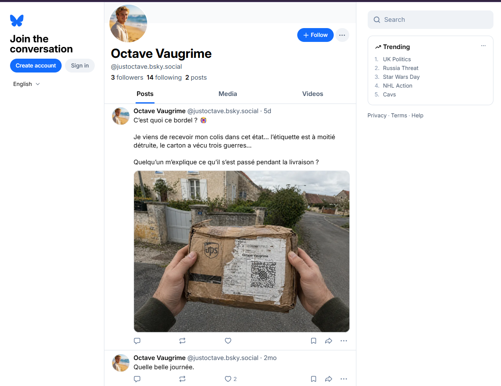
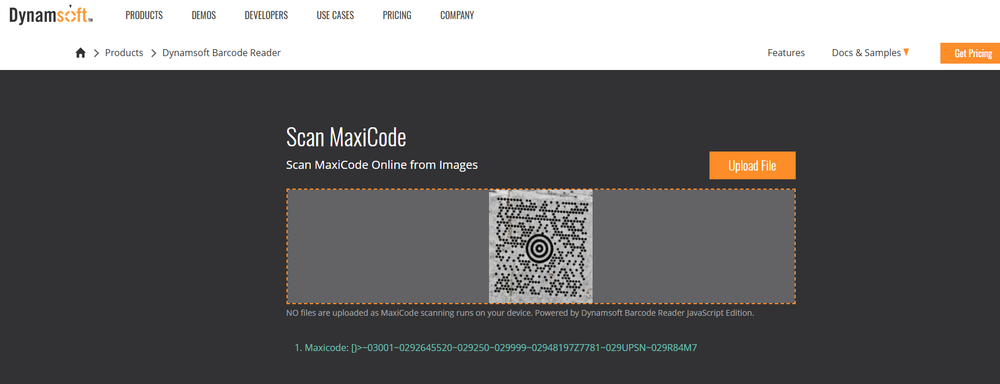

# Vieille complicité

Nous commençons avec le fichier JSON.

Après inspection, on se rend compte qu'il y a un seul message qui pourrait nous permettre de pivoter vers quelque chose :

On a ici un pseudo dans un SMS qui mentionne un site de lecture où l'on peut laisser des avis sur des livres.

Après quelques recherches sur Internet, on tombe assez rapidement sur le leader mondial dans le domaine, `https://goodreads.com`. On va chercher un utilisateur avec ce pseudo sur ce site.

L'utilisateur a 3 reviews de livres à son actif. Deux des reviews n'apportent aucun contenu intéressant, donc nous allons nous pencher sur la dernière.

Même si ce n'est pas nécessaire, nous pouvons faire le lien, avec un peu de flair et grâce à la description du challenge, que Mr.O est l'Octave dont elle parle dans sa review.

Elle mentionne également le nom d'un collège un peu farfelu.

Même si ce n'était pas prévu à la base, on peut retrouver la page sur le site Copains d'avant avec une simple recherche Google :-(

Sur la page du collège, on tombe sur le profil d'un certain Octave Vaugrime. Il mentionne qu'il n'utilise plus Twitter et poste sur un réseau décentralisé.

On cherche son nom sur les clones décentralisés de Twitter et on tombe rapidement sur son profil BlueSky.

Sur ce colis, on remarque qu'il y a un QR code assez exotique. C'est un MaxiCode UPS : https://en.wikipedia.org/wiki/MaxiCode

On prend une capture du MaxiCode et on peut le scanner sur un site comme :
https://www.dynamsoft.com/barcode-reader/barcode-types/maxicode/

On obtient la chaîne de caractères `[)>~03001~0292645520~029250~029999~02948197Z7781~029UPSN~029R84M7`

Dans l'ALT de l'image sur le compte bsky, on peut voir ces liens : https://www.barcodefaq.com/2d/maxicode/ et https://www.neodynamic.com/Products/Help/BarcodeWP1.0/barcodes/MaxiCode.htm

Avec ces infos, on peut comprendre que la partie `0292645520` de la chaîne de caractères est égale à :
`029` le header GS
`26` l'année de livraison
`45520` le code postal

Sa ville de résidence est donc Chevilly, 45520.

`BZHCTF{Chevilly}`
