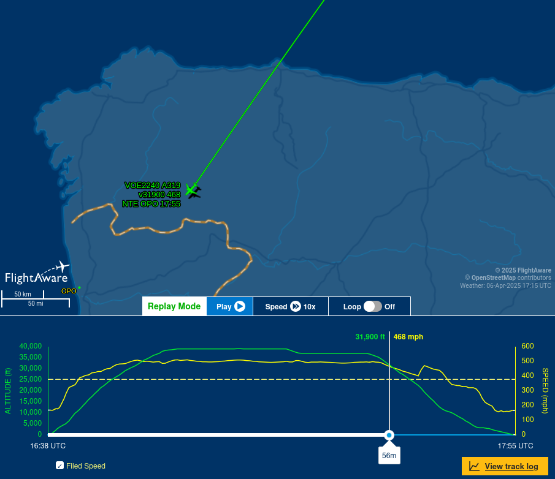
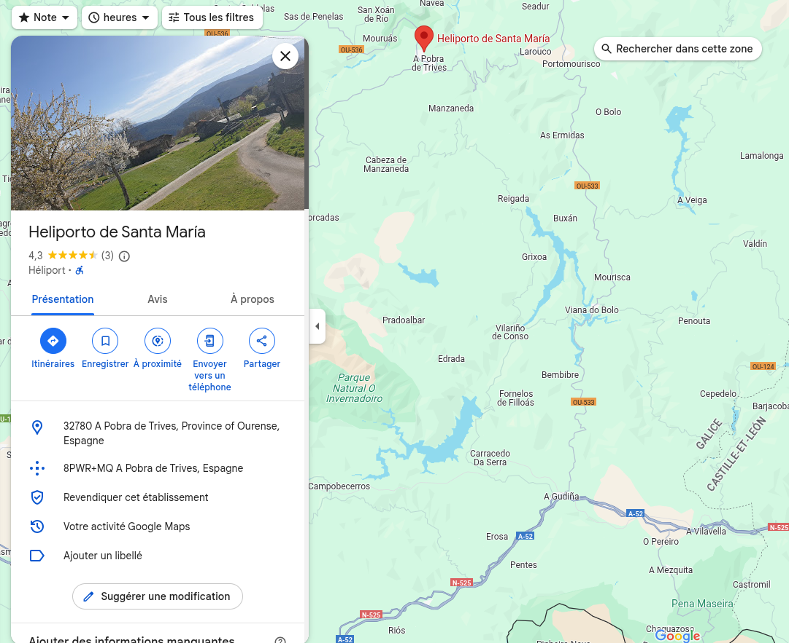

# Itineraire Fragile

La première étape — et la plus difficile — consiste à retrouver le vol exact.

Tout d’abord, on remarque que le billet d’avion indique le numéro de l’appareil : EC-MTC. Une recherche sur FlightAware montre qu’il s’agit d’un avion de la compagnie Volotea, ce qui correspond au logo présent sur le billet. 
https://fr.flightaware.com/live/flight/ECMTC

Ensuite, le fait que l’on nous précise que nous avons la photo originale n’est pas un hasard : cela sert à nous faire comprendre que les métadonnées sont toujours présentes. Grâce à ces dernières, nous obtenons la localisation du lieu où la photo a été prise : l’aéroport de Nantes:

```
$ exiftool boarding_ticket_picture_original.png 
ExifTool Version Number         : 12.57
File Name                       : boarding_ticket_picture_original.png
...
GPS Latitude                    : 47 deg 9' 25.35" N
GPS Longitude                   : 1 deg 36' 25.05" W
GPS Position                    : 47 deg 9' 25.35" N, 1 deg 36' 25.05" W
Date/Time Original              : 2025:04:06 16:18:00
```

On obtient également la date et l’heure originales de la prise de vue :
2025:04:06 16:18:00

On apprend dans la conversation que la photo a été prise précisément 20 minutes avant le décollage, ce qui signifie que nous cherchons un vol ayant décollé à 16h38.

Avec toutes ces informations, en consultant l’historique de l’avion sur FlightAware, on identifie le vol suivant : 
https://fr.flightaware.com/live/flight/ECMTC/history/20250406/1645Z/LFRS/LPPR

La ville de destination est donc Porto.

Il est également indiqué sur la page que la durée du vol était de 1h17.

Pour trouver la dernière partie du flag, toujours sur FlightAware, on va observer où se trouvait l’avion après 56 minutes de vol : 



Enfin, une simple recherche d’héliports sur Google Maps nous révèle la dernière partie du flag :



```
interiut{Porto_1h17_Santa-Maria}
```