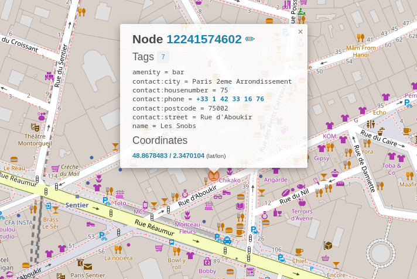
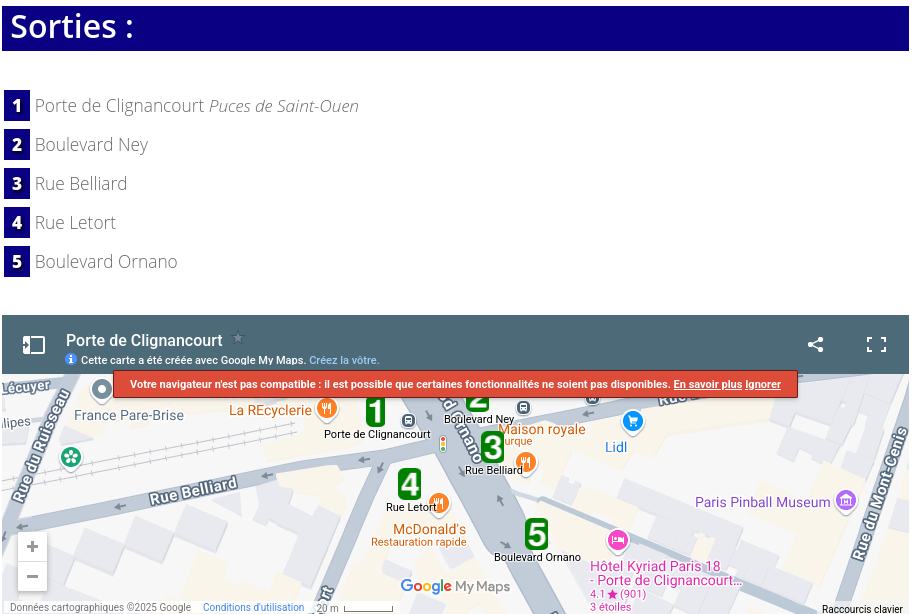
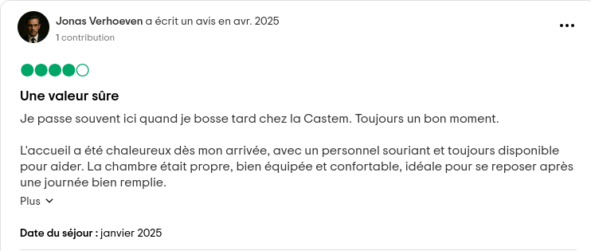

# Le Visage du Culte

On regarde les informations que Henri nous a transmises par mail:

```
Voici les informations que j'ai pu rassembler et qui pourraient vous aider à l'identifier, vous savez de qui je parle:

D’après ce que j’ai recoupé, il aurait laissé un avis public sur son hôtel favori à Paris.

J'ai également entendu dire qu’il existe un bar qu’il fréquente souvent lorsqu’il est en déplacement dans la capitale.
Ce bar serait situé à moins de 200 mètres d’un datacenter, à moins de 200 mètres d’un restaurant servant du fish and chips, et à moins de 550 mètres d’un transformateur électrique.

Une fois que vous sortez du bar, partez sur votre gauche et continuez tout droit jusqu’à atteindre une station de métro.
Prenez la seule ligne permettant de rejoindre un terminus en exactement 8 arrêts, puis descendez à ce dernier.
Choisissez la sortie portant le chiffre le plus élevé, puis prenez le passage sur votre droite.
L’hôtel sera le premier bâtiment à votre droite.
```

On se rend compte que, pour trouver le bar, il va falloir utiliser Overpass Turbo :
https://overpass-turbo.eu/

Voici la requête qui permet de localiser le bar : 

```
[out:json][timeout:25];

{{geocodeArea:Paris}}->.searchArea;

(
nwr["telecom"="data_center"](area.searchArea);
)->.dc;

(
nwr["amenity"="restaurant"]["cuisine"="fish_and_chips"](area.searchArea);
)->.fish;

(
nwr["power"="transformer"](area.searchArea);
)->.transfo;

node(around.dc:200)(around.fish:200)(around.transfo:550)["amenity"="bar"](area.searchArea);

out geom;
```

Qui nous donne:


Le nom du bar est donc Les Snobs.

On continue ensuite vers la gauche jusqu’à atteindre la station de métro Strasbourg - Saint-Denis.

La seule ligne qui respecte les conditions est la ligne 4, avec pour terminus Porte de Clignancourt. On prend donc la sortie portant le chiffre le plus élevé : la sortie 5. 



On prend le passage a droite et le premier hotel a notre droite est:
Hotel Kyriad Paris 18 - Porte De Clignancourt

On cherche les avis sur TripAdvisor et on tombe rapidement sur cet avis d'un individu qui parle de la castem:



```
interiut{Jonas_Verhoeven}
```