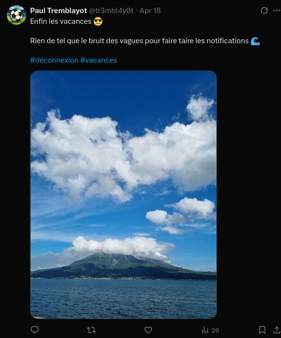

# Premiers pas
On nous parle d'un individu nommé "Paul Tremblayot"

On va chercher son nom sur différents réseaux sociaux et on va rapidement tomber sur son compte X:https://x.com/tr3mbl4y0t



Une recherche Google image inversé permet de découvrir que c'est le volcan Sakurajima situé au sud du Japon.

En cherchant un tout petit peu sur internet on remarque que la seule grande ville à côté du volcan est la ville de Kagoshima.

```
interiut{Kagoshima}
```