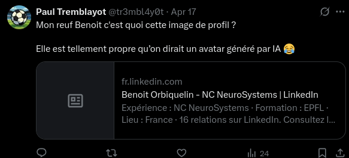
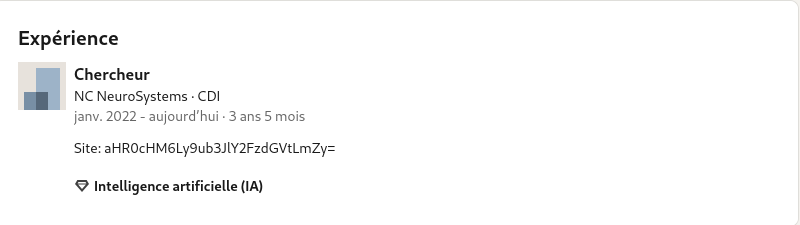
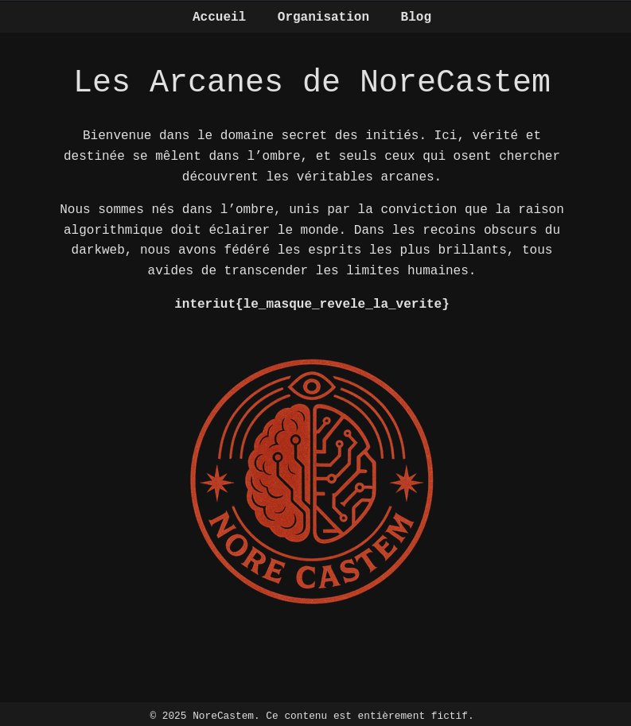

# Quelque chose cloche

On nous informe que "Paul aurait laissé un commentaire discret sur un individu, dont l’image de profil semble avoir attiré son attention"

En scrollant un tout petit peu sur le compte X de Paul on trouve le commentaire en question:



On nous parle ensuite du site de l'entreprise dans laquelle travaille Benoit. Quand on va sur son profil linkedin on remarque que il y est écrit "Site:" suivi d'une chaîne de caractères en base64



Une fois décodé, cela nous donne: "https://norecastem.fr"
On se rend donc sur le site.

En cherchant sur le site, on se rend compte qu'il y a dans le robots.txt:
`Disallow: /guide.txt`

On va sur guide.txt et on obtient un lien pastebin qui contient le message:

```
📜 Message aux Initiés
 
"Les portes secrètes ne s’ouvrent qu’à ceux qui savent se faire passer pour un autre."
 
Avant d’entrer, change l'identité que ton navigateur utilise pour se présenter.
 
Utilise exactement ce nom :
MembreNoreCastem1337
 
C’est là, dans ce que ton navigateur dit de toi — là où il s’identifie — que tout se joue.
 
🎭 Change ton masque, et la vérité apparaîtra.
```

Avec ce message on comprend qu'il faut changer notre user-agent avec MembreNoreCastem1337, on peut faire ça rapidement avec une extension du navigateur.

Une fois le user-agent changé on retourne sur https://norecastem.fr (bien à la racine du site) et on tombe sur la page secrète de la secte:



```
interiut{le_masque_revele_la_verite}
```

