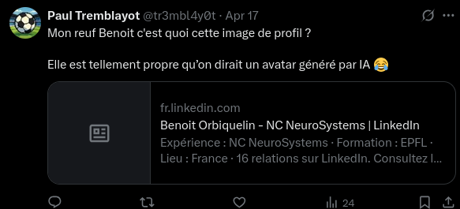
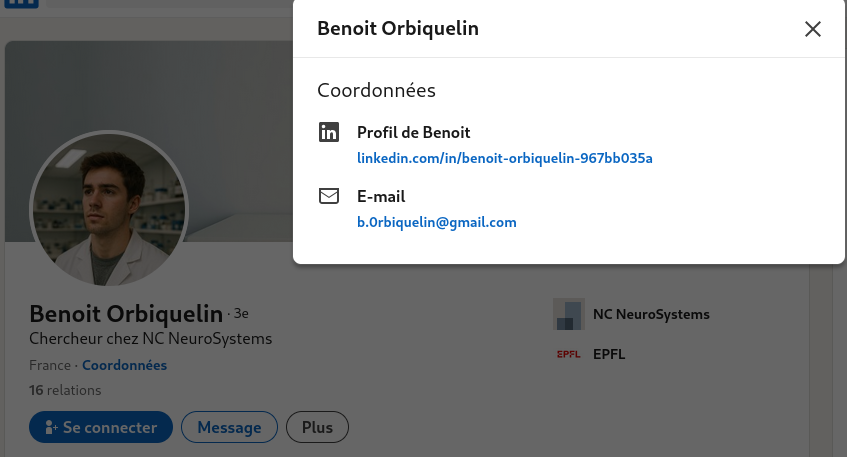

# Sur les traces du fidèle

On nous informe que "Paul aurait laissé un commentaire discret sur un individu, dont l’image de profil semble avoir attiré son attention"

En scrollant un tout petit peu sur le compte X de Paul on trouve le commentaire en question:



On se rend sur le profil linkedin de "Benoit Orbiquelin" et lorsqu'on clique sur le bouton Coordonnées on remarque que une adresse gmail est liée à son compte



Avec cette adresse email on peut effectuer un Epieos ou un Ghunt.

Voici les résultats obtenus avec Epieos:

à partir d'ici il y a 2 méthodes pour obtenir le flag.
### Première méthode

En allant voir ses avis google maps on peut voir que il y a un avis où Benoit dit "Le five de ma ville, je tape ici mes meilleurs retournés acrobatiques !"


On regarde de quelle ville il s'agit et ce five est situé dans la ville de Guipel 

```
interiut{Guipel}
```
### Deuxième méthode

En allant voir le lien google calendar et en remontant de 2 mois on remarque qu'il y a un évènement RDV à la Mairie avec en commentaire "Il faut que j'aille chercher une attestation de propriété de ma maison à la Mairie"


Il y a également sur l'évènement une adresse qui est indiquée, c'est l'addresse de la Mairie de Guipel.

```
interiut{Guipel}
```